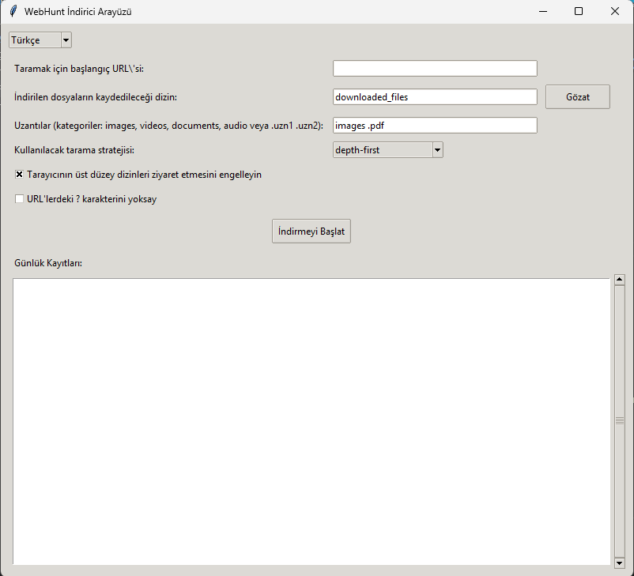

```
# WebHuntDownloader: Web Sitesi Dosya Tarayıcı ve İndirici

Bu Python tabanlı program, belirli bir web sitesini yinelemeli olarak taramanıza ve orijinal klasör yapısını koruyarak belirli uzantılara sahip dosyaları indirmenize olanak tanır. Bir alan adından medya, belge veya herhangi bir özel dosya türünü manuel kazıma veya indirme ile uğraşmadan kolayca almak isteyen kullanıcılar için tasarlanmıştır.

## 🔧 Özellikler

### ✅ Kullanımı Kolay

* Sadece başlangıç URL'sini sağlayın, program gerisini halleder.
* Hem GUI (.exe aracılığıyla) hem de CLI (Python aracılığıyla) kullanımını destekler.

### 🌐 Akıllı Tarayıcı

* Sağlanan URL altındaki tüm bağlantılı sayfaları otomatik olarak keşfeder.
* Ziyaret edilen her sayfadan indirilebilir dosyaları çıkarır.
* "Geriye doğru taramayı" önler (isteğe bağlı): Tarayıcının üst düzey dizinleri ziyaret etmesini durdurabilirsiniz.

  * Örnek: `https://example.com/folder/subfolder/` verildiğinde, bu özellik devre dışı bırakılırsa `https://example.com/folder/` adresini taramaz.

### 🧠 Dosya Filtreleme

* Hangi tür dosyaların indirileceğini seçin:

  * **Görüntüler** (`.jpg`, `.jpeg`, `.png`, `.gif`, `.webp`, `.svg`, vb.)
  * **Videolar** (`.mp4`, `.webm`, `.avi`, `.mov`, vb.)
  * **Belgeler** (`.pdf`, `.docx`, `.pptx`, `.xlsx`, vb.)
  * **Ses Dosyaları** (`.mp3`, `.wav`, `.ogg`, vb.)
  * Veya kendi özel uzantılarınızı tanımlayın.

### 📁 Klasör Yapısını Koruma

* Dosyalar, sunucudakiyle aynı göreli yola kaydedilir.

  * Örnek:
    `https://example.com/construction-updates/admin/projects/2020/04/xxx-scaled.jpg`
    →
    `/example.com/construction-updates/admin/projects/2020/04/xxx-scaled.jpg`

### 📊 Gelişmiş İndirme Raporları

* Tarama tamamlandıktan veya manuel olarak durdurulduktan sonra ayrıntılı bir özet görüntülenir.
* İçerir:

  * Keşfedilen toplam sayfa sayısı
  * İndirilen toplam dosya sayısı
  * Her dosya türünün sayısı
  * İndirilemeyen dosyalar
  * 10 MB'den büyük dosyalar
* Raporlar, filtreleme ve gelecekte başvurmak üzere bir **SQLite veritabanında** saklanır.

### 🖼️ GUI Arayüzü

* Tam bir grafik arayüz artık mevcut.
* URL seçin, dosya türlerini seçin ve düğmelerle taramayı başlatın/durdurun.
* Pencerede gerçek zamanlı durumu ve ilerlemeyi görün.



### 🛠️ Açık Kaynak ve Değiştirilebilir

* Depoyu klonlayabilir ve betiği gerektiği gibi değiştirebilirsiniz.
* Kolay özelleştirme için temiz ve iyi organize edilmiş kod tabanı.

---

## 🖥️ Nasıl Kullanılır

### Seçenek 1: Önceden Oluşturulmuş EXE'yi Kullanın

1. [Sürümler](https://github.com/aiproje/WebHuntDownloader/releases) bölümünden `.exe` dosyasını indirin.
2. Çalıştırın (kurulum gerekmez).
3. URL'yi girin, dosya türlerini seçin ve **İndirmeyi Başlat**'a tıklayın.
4. Sonuçlar yerel olarak tam dizin yapısıyla kaydedilecektir.
5. Raporları yerleşik GUI'de veya kaydedilmiş veritabanından görüntüleyin.

> ⚠️ İstenirse programın antivirüs/güvenlik duvarınızdan geçmesine izin verdiğinizden emin olun.

---

### Seçenek 2: Python Kaynak Kodunu Kullanın

#### 📥 Depoyu Klonlayın

```bash
git clone https://github.com/aiproje/WebHuntDownloader.git
cd WebHuntDownloader
```

#### 🐍 Sanal Ortam Oluşturun (İsteğe Bağlı Ama Önerilir)

```bash
python -m venv venv
source venv/bin/activate  # Windows'ta: venv\Scripts\activate
```

#### 📦 Gereksinimleri Yükleyin

```bash
pip install -r requirements.txt
```

#### ▶️ Programı Çalıştırın

```bash
python main.py --gui
```

> Giriş noktanız farklıysa dosya adını ayarlayın.

---

## 📌 Notlar

* Program varsayılan olarak robots.txt'ye uyar (uygulanmışsa).
* Hem derinlik öncelikli hem de genişlik öncelikli taramayı destekler (yapılandırılabilir).
* Hem göreli hem de mutlak URL'leri işler.
* Önbellek ve günlükleri kullanarak zaten indirilmiş dosyaları atlar.

---

## 🐞 Bir Hata Buldunuz veya Bir Özellik mi İstiyorsunuz?

Lütfen [Sorunlar](https://github.com/aiproje/WebHuntDownloader/issues) bölümünde bir sorun açın.

Dahil edin:

* Kullandığınız URL
* Herhangi bir hata mesajı
* Ne beklediğiniz ve ne olduğu

---

## 📄 Lisans

Bu proje açık kaynaklıdır ve [MIT Lisansı](LICENSE) altında mevcuttur.

---

## 🙌 Katkılar

Tüm katkıları memnuniyetle karşılıyoruz! Depoyu çatallamaktan ve aşağıdakiler için çekme istekleri göndermekten çekinmeyin:

* Hata düzeltmeleri
* Yeni özellikler
* UI/UX iyileştirmeleri
* Performans geliştirmeleri

---

AIPROJE ❤️ ile yapıldı

```