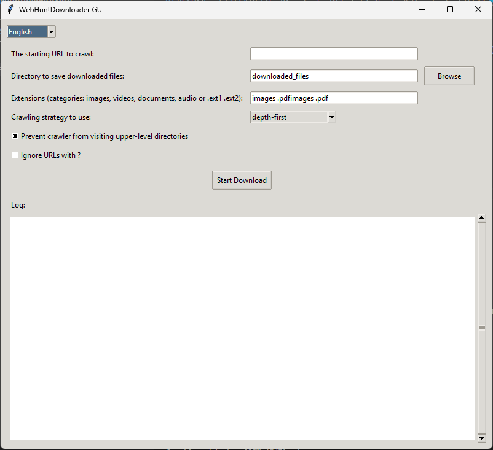

# WebHuntDownloader: Website File Crawler & Downloader

This Python-based program allows you to recursively crawl a given website and download files with specific extensions, preserving the original folder structure. It's designed for users who want to easily retrieve media, documents, or any specific file types from a domain without dealing with manual scraping or downloading.

## 🔧 Features

### ✅ Easy to Use

* Just provide the starting URL, and the program handles the rest.
* Supports both GUI (via `.exe`) and CLI usage (via Python).

### 🌐 Smart Crawler

* Automatically discovers all linked pages under the provided URL.
* Extracts downloadable files from each visited page.
* Prevents "backward crawling" (optional): You can stop the crawler from visiting upper-level directories.

  * Example: Given `https://example.com/folder/subfolder/`, it won’t crawl `https://example.com/folder/` if this feature is disabled.

### 🧠 File Filtering

* Choose which types of files to download:

  * **Images** (`.jpg`, `.jpeg`, `.png`, `.gif`, `.webp`, `.svg`, etc.)
  * **Videos** (`.mp4`, `.webm`, `.avi`, `.mov`, etc.)
  * **Documents** (`.pdf`, `.docx`, `.pptx`, `.xlsx`, etc.)
  * **Audio Files** (`.mp3`, `.wav`, `.ogg`, etc.)
  * Or define your own custom extensions.

### 📁 Folder Structure Preservation

* Files are saved in the same relative path as on the server.

  * Example:
    `https://example.com/construction-updates/admin/projects/2020/04/xxx-scaled.jpg`
    →
    `/example.com/construction-updates/admin/projects/2020/04/xxx-scaled.jpg`

### 📊 Advanced Download Reports

* A detailed summary is displayed after the crawl is completed or stopped manually.
* Includes:

  * Total pages discovered
  * Total files downloaded
  * Number of each file type
  * Files that failed to download
  * Files larger than 10MB
* Reports are stored in a **SQLite database** for filtering and future reference.

### 🖼️ GUI Interface

* A full graphical interface is now available.
* Select URL, choose file types, and start/stop crawling with buttons.
* See real-time status and progress in the window.



### 🛠️ Open Source and Modifiable

* You can clone the repository and modify the script as needed.
* Clean and well-organized codebase for easy customization.

---

## 🖥️ How to Use

### Option 1: Use the Pre-Built EXE

1. Download the `.exe` file from the [Releases](https://github.com/aiproje/WebHuntDownloader/releases) section.
2. Run it (no installation required).
3. Provide the URL, select file types, and click **Start Download**.
4. Results will be saved locally with full directory structure.
5. View reports in the built-in GUI or from the saved database.

> ⚠️ Make sure to allow the program through your antivirus/firewall if prompted.

---

### Option 2: Use the Python Source Code

#### 📥 Clone the Repository

```bash
git clone https://github.com/aiproje/WebHuntDownloader.git
cd WebHuntDownloader
```

#### 🐍 Create a Virtual Environment (Optional but Recommended)

```bash
python -m venv venv
source venv/bin/activate  # On Windows: venv\Scripts\activate
```

#### 📦 Install Requirements

```bash
pip install -r requirements.txt
```

#### ▶️ Run the Program

```bash
python main.py --gui
```

> Adjust the filename if your entry point differs.

---

## 📌 Notes

* The program obeys robots.txt by default (if implemented).
* Supports both depth-first and breadth-first crawling (configurable).
* Handles both relative and absolute URLs.
* Skips already downloaded files using cache and logs.

---

## 🐞 Found a Bug or Want a Feature?

Please open an issue in the [Issues](https://github.com/aiproje/WebHuntDownloader/issues) section.

Include:

* The URL you used
* Any error messages
* What you expected vs what happened

---

## 📄 License

This project is open source and available under the [MIT License](LICENSE).

---

## 🙌 Contributions

We welcome all contributions! Feel free to fork the repo and submit pull requests for:

* Bug fixes
* New features
* UI/UX improvements
* Performance enhancements

---

Made with ❤️ by AIPROJE